# Patrulla i formacions

Tant important és saber formar com saber disparar. De poc serveix un grup de soldats experts en l'ús del fusell, si no saben adoptar la formació correcta en cada moment. En aquest capítol aprendràs a formar al camp de batalla.

## Formacions

Aquestes són algunes de les formacions principals que es fan servir la major part del temps. Són fàcils d'establir, controlar i són molt flexibles. Existeixen altres tipus de formacions menys comunes, i totes aquestes es poden combinar per maximitzar l'eficàcia de la unitat.

La idea de les formacions és la de mantenir els sectors de cobertura enfocats segons la situació i els interessos de la unitat. Cal tenir en compte que algunes formacions són pensades per ser emprades juntament amb altres unitats.

### Tascó

La formació de tascó és molt versàtil ja que és fàcil d'establir i controlar. Permet una bona bona observació del voltant i un bona seguretat, i es pot utilitzar en la majoria de les situacions que et puguis trobar. El foc pot ser orientat en qualsevol direcció amb bona quantitat i permet una bona visibilitat dels possibles contactes entrants.

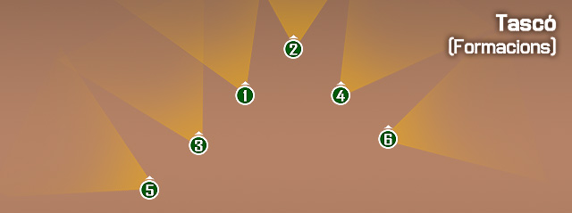{: .center}

La formació de tascó s'empra a nivell d'Escamot. Esquadra i Equip de foc, on el nombre d'unitats fa que sigui possible fer-la servir.

Si s'utilitza a nivell d'Escamot, el comandant de l'escamot normalment va a la saga de l'esquadra líder, posant-se a si mateix enmig de la formació on pugui obtenir un millor control de l'Escamot. Quan s'utilitza a nivell d'Equip de foc, el líder és la punta de la formació, i els membres de l'Equip de foc es guien pels seus passos.

La formació de tascó és la que es fa servir la major part del temps, i és també la formació preferida per utilitzar ja sigui a l'Escamot com a l'Esquadra o l'Equip de foc, quan et mous a través de les àrees on el contacte podria venir de qualsevol direcció.

Quan no s'indiqui el contrari, la formació per defecte per esquadres és la formació en tascó.

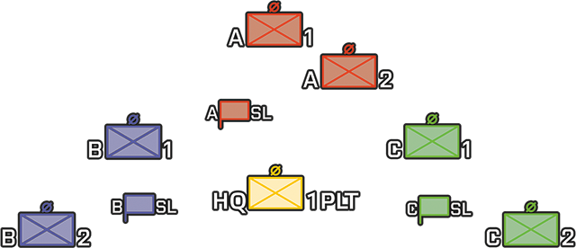{: .center}

### Línia

La formació en línia és molt adequada per avançar cap a una amenaça coneguda o sospitada amb el màxim nombre d'armes preparades, i es destaca per la col·locació d'un gran volum de foc al capdavant de la formació.

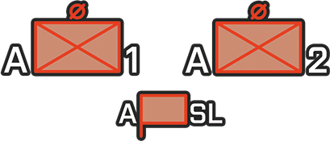{: .center}

La formació en línia ofereix camps superposats d'observació i foc pesat en la part davantera.

És relativament fàcil de controlar, però no ofereix una gran seguretat als flancs com a la rereguarda.

{: .center}

És natural que una formació en línia formi un arc lleugerament en la direcció del moviment, com en la imatge de sota.

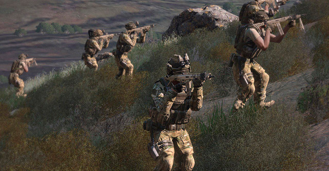{: .center}

Com s'hagi de controlar això depèn de la situació del terreny i enemic, mantenir una línia perfecta pot donar lloc a que prestis massa atenció a la teva formació, i molt poca atenció cap a l'amenaça.

### Columna (Esglaonada)

La formació en columna és la formació més senzilla d'establir, ja que és només una qüestió de seguir el líder. Permet un moviment molt ràpid a causa d'això. Aquesta formació és la millor opció durant el viatge quan el contacte no s'espera de forma imminent o la velocitat és d'alta prioritat.

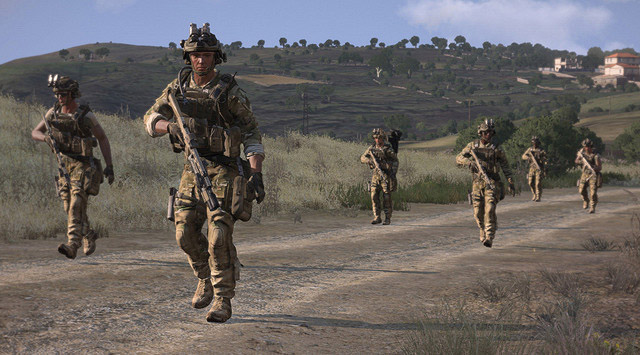{: .center}

Una formació en columna té un gran poder de foc per als flancs, però no està orientada cap al contacte a la part davantera (on és vulnerable). Una columna pot canviar ràpidament en entrar en contacte a una línia o una altra formació apropiada, donant una bona flexibilitat.

La formació en columna es pot utilitzar quan es viatja a través d'una àrea on no és pràctic fer servir una línia, tascó, o una altra formació. Per exemple, viatjar a través d'una vall restringida podria requerir una columna.

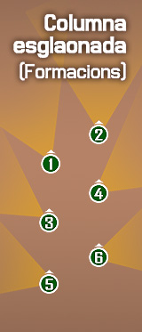{: .right}

És important tenir en compte que les formacions de "columna" no han de consistir en una sola fila perfectament alienada. L'esglaonament de la columna perquè ningú es trobi directament en la línia de l'altre ajuda a reduir la vulnerabilitat que la formació tindria d'una altra manera des de la part davantera i posterior.

És una formació molt efectiva per contrarestar emboscades enemigues, sempre que s'apliquin les tècniques de seguretat i exploració adequades per aquestes situacions.

### Esglaó (esquerra i dreta)

La formació en esglaó es pot establir quan es viatja en una àrea on és molt probable que la direcció de l'amenaça sigui a l'esquerra o a la dreta de la línia de desplaçament. Aquesta és, bàsicament, només la meitat de la formació en tascó, i centra poder de foc cap al flanc que s'ha esglaonat.

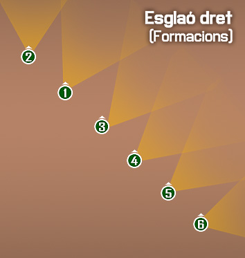{: .left}

És una formació molt habitual, ja que els escamots van descomponent les seves unitats en esglaons conforme és necessari.

Com sempre, l'element líder es sol situar al darrera de la línia, per mantenir una bona visió de les unitats a l'hora que augmenta la seva seguretat.

Així, sempre que sigui possible el líder no estarà formant en la línia, si no que se situarà per darrera, per poder dedicar-se exclusivament a mantenir la formació i gestionar el seu grup.

La formació d'esglaó no es sol emprar per una unitat individual, si no que solen aplicar-se a varies unitats, per tal que una cobreixi un costat i l'altra el contrari.

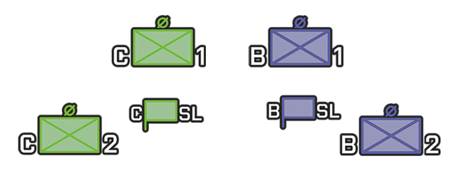{: .center}

### V

El V és una inversió de la formació en tascó, en què dos elements lideren el grup, un tercer actua com a cua, i el líder de l'element roman al centre per al control de la formació i el moviment. Aquesta formació pot ser bona quan se sap que el contacte serà majoritàriament provinent de la part davantera, però no et vols comprometre amb una formació en línia i desitges mantenir la flexibilitat.

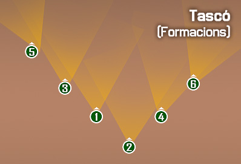{: .left}

L'element de cua permet mantenir la seguretat a la rereguarda, a l'hora que dóna la possibilitat de rellevar una esquadra de la línia del front, o flanquejar l'enemic des de darrera nostre, limitant així la possibilitat de ser descoberta la maniobra per l'enemic.

### Columna compacta

La columna compacta és una forma senzilla de seguir el líder, fins i tot més bàsica que la columna. A una columna compacta, cada soldat segueix al que te davant d'ell. La columna compacta permet un gran nombre de tropes moure's en el mateix tros de terra, sense desviar-se de la persona al davant d'ells.

La columna compacta s'utilitza sobretot quan es travessa camps de mines antipersones, o quan s'opera en condicions de visibilitat molt limitada, amb capacitats de comunicació igualment limitades o sense.

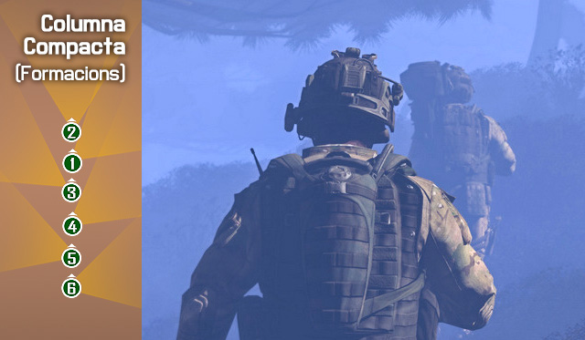{: .center}

## Patrulla

La patrulla és un desplegament de forces terrestres, navals, o aèries, enviades amb el propòsit de trobar informació, destruir, assetjar, trampejar o fer una missió de seguretat.

Un comandant ha de comptar amb informació actualitzada sobre l'enemic i el terreny per tal d'emprar la unitat de forma efectiva. Les patrulles són un mitjà important per aconseguir aquesta informació i s'utilitzen per destruir instal·lacions enemigues, capturar personal enemic, realitzar missions de seguretat o evitar que l'enemic guanyi informació. La guerra moderna posa un gran èmfasi en el patrullatge efectiu perquè les unitats tenen àrees més grans d'operacions i poden ser amenaçades des de totes direccions. Quan les distàncies entre les unitats augmenten, més patrullatge es fa necessari per evitar la infiltració de guerrillers o unitats enemigues petites, així com per mantenir el contacte amb les unitats adjacents amigues.

La patrulla es fa servir quan no s'espera un contacte immediat amb l'enemic, i s'ha de controlar una zona gran de terreny. És bàsicament un sistema per guardar una parcel·la de terreny o una zona molt concreta, però sense saber si l'enemic pot atacar.

Vigilar una zona amb moviments tàctics volies dir tàctics??, seria esgotador pels soldats, i certament innecessari si no es preveu un contacte imminent, per evitar això, s'adopta una tècnica i actitud de patrulla, que permet mantenir un bon grau de vigilància sense desgastar la unitat.

### Tipus de patrulles

#### Classificades segons missió

##### Patrulla de reconeixement

Les patrulles de reconeixement reuneixen informació sobre l'enemic, terreny o recursos. Confiant en el sigil en lloc de la força de combat, reuneixen aquesta informació i lluiten només quan és necessari per completar la missió o per defensar-se. La distància recorreguda per les patrulles de reconeixement varia en funció del terreny i la missió. L'Esquadra és ideal per a tasques de reconeixement, perquè no és una unitat massa gran i està experimentada a l'hora de treballar junta.

##### Patrulla de combat

Una patrulla de combat és assignada a missions que requereixen entrar en combat amb l'enemic. Més grans i més fortament armades que les patrulles de reconeixement, les patrulles de combat tenen com a missió capturar documents enemics, proporcionar seguretat, i capturar o destruir equipaments i instal·lacions enemigues. Independentment de la missió, les patrulles han d'informar de tota la informació sobre l'enemic i el terreny adquirits durant la realització de missió assignada. Hi ha quatre tipus de patrulles de combat: assalt, contacte, emboscada, i seguretat. Un escamot de fusellers reforçat amb armes de tripulació es considera normalment el mínim per una patrulla de contacte, assalt o emboscada. En algunes situacions, com ara la captura d'un petit lloc d'avançada de l'enemic, un escamot de fusellers podria fer una incursió.

#### Classificades segons el tipus de moviment

##### Patrulles a peu

El moviment a peu és el mitjà més comú. Tanmateix, hi ha desavantatges inherents. Les patrulles a peu viatgen lentament i porten quantitats limitades d'equipament i subministres. El rang i l'àrea de cobertura són relativament restringits. Les patrulles a peu també tenen aparents avantatges com menys restriccions pel que fa al terreny que poden cobrir, són més difícils de detectar per l'enemic, proporcionen una cobertura completa dins dels límits de l'àrea de distribució; i generalment no són inhibides pel clima.

##### Patrulles motoritzades

Quan el terreny i les xarxes de carreteres ho permeten, una patrulla motoritzada supera els desavantatges inherents de la patrulla a peu. Les forces mecanitzades requereixen unitats de patrulla que puguin seguir el seu ritme. No obstant això, les patrulles motoritzades estan restringides a certs tipus de terreny, i tendeixen a evitar àrees que poden ser avantatjoses per la infanteria enemiga que les ocupen.

##### Patrulles amfíbies

Les patrulles amfíbies es mouen sobre mars, llacs, rius i rierols, canals i altres vies navegables interiors. L'aigua o bé s'utilitza com un mitjà d'entrada a una zona objectiu o és la ruta de la patrulla real. Les patrulles amfíbies estan limitades per la ubicació de les rutes d'aigua al terreny i tendeixen a evitar àrees que poden ser avantatjoses per l'enemic que les ocupa.

##### Patrulles aèries

On el terreny és extremadament difícil o la situació de l'enemic impedeix l'ús de vehicles o patrulles motoritzades, les patrulles aèries són mètodes o mitjans per dur a terme una patrulla.

### Claus per a patrulles satisfactòries

Independentment del tipus de patrulla o la situació, les claus per a una bona patrulla són:

  - Pla detallat. Cada etapa de la patrulla ha de ser detallada, totes les contingències han de ser considerades.
  - Reconeixement minuciós. Es farà un reconeixement físic del ruta i l'objectiu. Fotografies i/o mapes es farà servir com a complement dels reconeixements.
  - Control positiu. El cap de la patrulla estarà obligat a mantenir un control positiu, el que inclou la supervisió durant la preparació de la patrulla.
  - Tot al voltant de la seguretat. La seguretat s'ha de mantenir en tot moment, sobretot a prop del final de la patrulla on hi ha una tendència natural a relaxar-se.

### Organització general

El líder de patrulla ha d'establir el comandament de patrulla i els elements per acomplir la missió.

El comandament està compost pel cap de la patrulla i el personal que proporciona suport per tota la patrulla, com un observador avançat, un metge, i un operador de ràdio.

- **Comandància de l'Escamot (Element de comandament):**
	- Líder de patrulla (líder d'Escamot).
	- Assistent del líder de patrulla (Sergent d'Escamot).
	- Navegador.
	- Operador de ràdio (Malla tàctica de la companyia).
	- Operador de ràdio (Malla tàctica de la patrulla).
	- Metge.
- **La primera esquadra (element de seguretat)** proporciona la seguretat a la ruta fins a l'àrea objectiu (la punta, seguretat de flanc, i seguretat de cua) i a l'àrea objectiu (els flancs i al punt de reunió objectiu).

- **La segona esquadra (element de suport)** recolza amb foc a l'atac, fent foc de cobertura per la retirada i foc de suport per creuar àrees perilloses.

- **La tercera esquadra (element d'assalt)** proporciona la força d'assalt per atacar i capturar l'objectiu; reconeixement per netejar l'objectiu; guies, navegadors, i assistent del líder de patrulla a la ruta i al retorn de l'àrea objectiu.

### Moviment cap a i des de l'àrea objectiu

La utilització correcte de les formacions és critic per l'èxit de la patrulla. La formació mes habitual per patrullar és la columna, però és el líder de patrulla qui ha de determinar en tot moment la formació mes idònia segons el tipus de terreny i la situació.

#### Conceptes Bàsics

Per tal d'adaptar la formació correctament a la patrulla, s'han de tenir en compte uns conceptes bàsics.

  - Qualsevol tipus de columna és la formació habitual (però no única) de la patrulla. Una patrulla s'adapta al terreny i situació.
  - Els líders s'han de situar en posicions que permetin un bon control dels elements de la patrulla, a l'hora que minimitzen la seva exposició a l'enemic.
  - Els assistents (com Operadors de ràdio, Assistents de Fuseller Automàtic, etc...) s'han de situar en posicions properes als membres que assisteixen.
  - L'assistent del líder de Patrulla s'ha de situar en una posició enrederida per controlar la zona posterior de la patrulla.
  - La separació entre soldats ha de ser suficient per evitar que una arma explosiva (granades, coets,...) pugui eliminar més d'un soldat.
  - Les patrulles han de comptar amb homes punta, que explorin el terreny del davant, situant-se al limit raonable de distància (fins a 100 metres) sense trencar el contacte visual. Normalment entre un o dos.
  - Les patrulles han de comptar amb exploradors, que vigilin els flancs, evitant així emboscades enemigues des del flanc.
  - Les patrulles han de designar normalment un únic home de cua (o contramesura), per proveir la seguretat a la rereguarda. Aquest s'ha de situar al limit visual, i fins a 50 metres.

#### Zona de seguretat

Les patrulles poden ser vulnerables als atacs enemics, com les emboscades, per tant, s'ha de mantenir una cobertura constant de tots els sectors de risc. Això implica expandir la nostra zona de control mes enllà del perímetre immediat. Els enemics, solen amagar-se als flancs, esperant que passem per atacar-nos pel costat, o amb un atac en L.

Per evitar que l'enemic pugui entrar a la nostra zona de maniobra, i per tant ens negui la possibilitat de maniobrar durant un atac, hem de col·locar soldats allunyats de la nostra columna principal, que explorin. Homes en punta que s'assegurin que al davant no hi han mines o altres trampes, que vegin l'enemic abans que el gruix de la nostre patrulla i per tant ens doni temps a reaccionar.

Exploradors laterals que puguin detectar enemics als nostres flancs, i així negar-los aquest avantatge. Soldats a la cua, per avisar-nos si l'enemic intenta atacar-nos per la rereguarda.

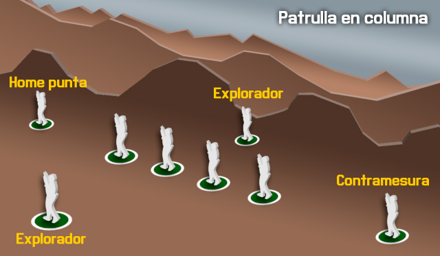{: .center}

Els homes en punta, i exploradors cal que vagin pentinant el perímetre, no avançat en línia recta, si no fent zigzagueigs. En l'home en punta és important per trobar trampes en el camí, i en els exploradors per maximitzar la possibilitat de trobar enemics emboscats.

#### Exemple de formació

A l'hora d'establir la formació, s'han de tenir en compte aquests rols específics.

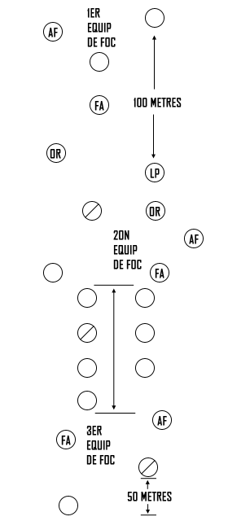{: .right}

**LP** – líder de patrulla/líder d'Esquadra.  
**OR** – Operador de ràdio.  
**FE** – Seguretat del flanc esquerra.  
**FD** – Seguretat del flanc dret.  
**PT** – Home punta.

Així, en un exemple de formació de patrulla, podríem tenir aquesta formació.

Com veiem, el líder de Patrulla ha d'anar cap al mig i una mica avançat, per controlar tota la patrulla i poder guiar correctament la navegació. Els Operadors de ràdio es situen a prop del LP, els 3 Fusellers Automàtics es col·loquen a davant, el mig i darrera, amb els seus Assistents a prop, i els Líders d'Equip de foc també es posicionen per poder controlar el seu equip sense exposar-se massa ells mateixos.

Les columnes no són perfectes, sinó que deixen espais entre línies perquè els soldats puguin disparar sense tenir la visió bloquejada pels altres companys.

Cal tenir present que les distàncies no són representatives, ja que els soldats laterals que s'encarreguen de l'exploració per exemple solen mantenir una distància elevada, com els homes en punta o les contramesures.

### Mesures de control pel moviment

#### Punts de control

Els punts de control són punts predeterminats al terreny, establerts abans de començar la patrulla per guiar i controlar el moviment de la mateixa. Permeten seguir el progrés de la patrulla sense haver de transmetre coordenades, fet que minimitza la possibilitat que l'enemic pugui conèixer la zona d'operació de la patrulla, a l'hora que fa més fàcil i ràpid identificar el punt.

#### Punts de reunió

Un Punt de reunió és un punt fàcilment identificable al terreny on les unitats poden reagrupar-se i reorganitzar-se si són dispersades. Han de donar cobertura i ocultació, han de ser defensables per un període curt de temps i ser fàcilment identificables per tots els membres de la patrulla.

##### Punt de reunió inicial

És el punt on reagrupar-se si la patrulla és dispersada abans de sortir de la zona amiga.

##### Punt de reunió a ruta

És un punt o punts entre el punt de reunió inicial i el punt de reunió objectiu, perquè la patrulla es reagrupi si ha estat dispersada per l'enemic.

##### Punt de reunió objectiu

El punt de reunió objectiu es col·loca a prop de l'objectiu, i és on la patrulla pot fer els preparatius finals per l'aproximació final a l'objectiu. També serveix perquè la patrulla es reagrupi un cop completades les tasques al seu objectiu. Aquest punt ha de proveir ocultació de l'observació enemiga, i si és possible, cobertura del foc enemic. Ha d'estar a prop del flanc, o més enllà de l'objectiu. Ha d'estar fora de l'abast visual, sonor, i del rang d'armes petites de l'àrea objectiu. L'exploració de l'objectiu ha de començar des d'aquí, i és el punt de partida dels elements i equips de la patrulla per completar la missió.

### Precaució en àrees de perill

Un àrea de perill és qualsevol lloc on la patrulla és vulnerable a l'observació o foc enemic. Àrees obertes, carreteres, vies, obstacles com camps de mines, filferro, rius i rierols, i llacs. Qualsevol posició enemiga coneguda o sospitada passa a ser àrea de perill, i el líder de patrulla ha de planificar com travessar la zona.

La patrulla ha de reconèixer la zona propera de l'àrea de perill primer, per tant el líder de patrulla ha d'enviar exploradors més enllà de l'àrea de perill. Si els exploradors informen que l'altre costat de l'àrea de perill està lliure d'enemics, la patrulla ja pot creuar la zona.

En rius, carreteres o vies, primer s'ha de reconèixer el costat mes proper, i després l'altre costat, si els exploradors confirmen que està tot net, llavors la resta de la patrulla pot creuar.

### Ocultació

Quan la patrulla s'hagi d'aturar per un període de temps extens en una àrea no protegida per tropes amigues, la patrulla s'haurà de moure a una localització que, per la naturalesa del terreny circumdant, proporcioni seguretat passiva de detecció de l'enemic.

El pla de patrulla del líder ha de incloure zones d'ocultació quan la missió de patrulla dicti una aturada llarga en zona enemiga. El pla per a l'ocultació ha d'incloure mesures passives i actives de seguretat.

#### Mesures passives d'ocultació

  - Eviteu les àrees urbanitzades.
  - Eviteu posicions enemigues conegudes o sospitades.
  - Eviteu les carenes, crestes topogràfiques, valls, llacs i rierols.
  - Eviteu els camins i senders.
  - Seleccioneu les àrees que ofereixen una densa vegetació, preferiblement matolls i arbres que s'estenen prop del terra.

#### Mesures actives d'ocultació

  - Establir la seguretat a totes les vies d'apropament possibles.
  - Establir les comunicacions (ràdio, senyals, missatgers) amb la seguretat apostada per proveir d'una ràpida alerta de l'apropament de l'enemic.
  - Establir una àrea alternativa d'ocultació, si la principal és compromesa.
  - Fer un pla de retirada en cas de ser descoberts.

### Accions immediates en contactar amb l'enemic

Una patrulla pot contactar amb l'enemic en qualsevol moment. El contacte pot ser per observació, trobada de combat o emboscada. Quan una patrulla detecta un enemic i aquest no ha detectat la patrulla, el líder de patrulla ha de decidir si establir combat o esquivar la patrulla, segons la seva missió.

Quan la missió de patrulla prohibeixi el contacte físic (excepte el necessari per acomplir la missió), les accions seran defensives per naturalesa. El contacte és evitat i ràpidament trencat en cas de produir-se.

Quan la missió de patrulla permeti o requereixi el contacte físic, les accions hauran de ser ofensives per naturalesa.

Hi ha dos tipus de contacte físic, la trobada de combat i l'emboscada. La trobada de combat és quan una força en moviment, no desplegada completament pel combat, entra en combat amb l'enemic en una zona i hora no esperada. És una trobada accidental on ni la patrulla ni l'enemic esperaven entrar en combat. Una emboscada és un atac per sorpresa des d'una posició oculta.

#### Accions immediates

Les accions immediates són designades per a proveir a una petita unitat d'una ràpida reacció al contacte enemic amb el mínim d'ordres necessàries. Com que és impossible establir les acciones per qualsevol tipus de situació que es pugui produir, és millor establir unes pautes bàsiques per una quantitat limitada de situacions habituals.

##### Aturada immediata

Quan la patrulla detecti un enemic però aquesta no sigui detectada, la situació requereix d'una aturada immediata de la patrulla al lloc. El primer membre en detectar visualment l'enemic ha de donar la senyal de Congelar (o dir *Quiets\!*). Tots els membres s'han d'aturar al lloc, amb l'arma preparada i totalment immòbils fins que es donin noves ordres.

##### Observació aèria o atac

Quan la patrulla detecti una aeronau enemiga o no identificada, l'acció és la de *CONGELAR* fins que el líder de patrulla identifiqui l'aeronau i doni les ordres.

Quan l'aeronau enemiga detecta la patrulla i fa un atac a baixa cota, el primer membre en detectar-ho a de avisar amb *AVIÓ/HELICOPTER*, seguit de la direcció de l'atac, *ESQUERRA*, *DRETA*, *DAVANT*, *DARRERA*. La patrulla s'ha de moure immediatament a una formació en línia, perpendicular a l'atac enemic, i amb el cos a terra orientat també en perpendicular a l'aeronau. Entre atacs els membres de la patrulla han de cercar posicions de cobertura. L'atac a l'aeronau només pot ser ordenat pel líder de patrulla.

##### Trobada de combat

**Emboscada ràpida.** Aquesta acció immediata es fa servir per evitar el contacte i preparar-se per a una emboscada no planejada sobre l'enemic. És una consecució posterior a l'ordre de *CONGELAR*. Quan la senyal *EMBOSCADA RÀPIDA* es doni (per l'home en punta, el líder de patrulla, o qualsevol membre autoritzat de la patrulla), tota la patrulla es mourà ràpidament cap a dreta o esquerra de la línia de moviment, segons el senyal indicat, i prendrà ràpidament les millors posicions ocultes de foc possibles. El líder de patrulla iniciarà l'emboscada disparant i cridant *FOC*. Si la patrulla és detectada abans d'això, el primer membre alertat de la detecció iniciarà l'emboscada disparant i cridant l'ordre. També es pot delegar l'inici de l'emboscada a un membre de la patrulla posterior, per assegurar-se que l'enemic arribi fins a certa alçada abans d'obrir foc.

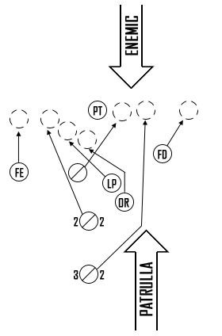{: .right}

**Assalt immediat.** Aquesta acció immediata es fa servir defensivament per trencar ràpidament un contacte no desitjat però inevitable (incloent l'emboscada) o ofensivament per atacar amb decisió l'enemic (incloent l'emboscada). Quan es fa servir en una trobada de combat, els membres més propers a l'enemic obren foc i criden *CONTACTE*, seguit per la direcció de l'enemic, *DAVANT*, *ESQUERRA*, *DRETA*, *DARRERA*. La patrulla es mou ràpidament a una formació en línia i assalta.

**Contraemboscada**

Quan la patrulla és emboscada, s'ha de diferenciar entre emboscada propera (l'enemic és a menys de 50 metres) i emboscada llunyana (l'enemic és a més de 50 metres). Cinquanta metres és considerat el limit en el qual una patrulla pot realitzar un assalt efectiu sobre l'enemic.

**Emboscada propera.** En una emboscada propera, la zona de mort és sota foc intensiu, concentrat, i proper. Això dóna poc espai i temps als membres per maniobrar o cercar cobertura. Com més temps passin a la zona de mort, més probabilitats de ser neutralitzats tenen. Per això, quan una patrulla es trobi en aquesta situació, ha d'efectuar immediatament un assalt a l'enemic sense esperar senyals o ordres, ocupant el seu espai, fins que es trenqui el contacte. Aquesta acció mou la patrulla fora de la zona de mort, i evita que altres elements de l'emboscada puguin disparar, per evitar ferir els seus companys. Els membres fora de la zona de mort hauran de maniobrar en conseqüència.

**Emboscada llunyana.** En una emboscada llunyana, la zona de mort és sota foc intensiu i concentrat, però a gran distància. Aquesta elevada distància proveeix als membres de la patrulla l'espai i el temps necessari per maniobrar, tot cercant cobertures. Si la patrulla és en una emboscada llunyana, els membres a la zona de mort han de retornar el foc. Els membres fora de la zona de mort han de maniobrar cap a l'enemic.

En qualsevol d'ambdues situacions, l'èxit de la contraemboscada depèn de l'entrenament dels membres per mesurar correctament la distància i per tant identificar el tipus d'emboscada, així com reaccionar correctament a l'amenaça.
